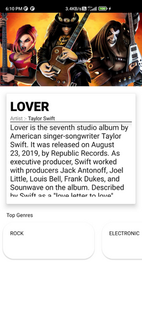

# mussic-wiki
#### Introduction
mussic-wiki is an android application. This app is created using by the MVVM architecture. For building the application, View-binding, Retrofit, and the Coroutin Library are used. Lastfm api(https://www.last.fm/api) is used to fetched.

# Overall Features
## 1. Home Screen
This screen show a list top of genres. Initially, just 10 items are shown; however, when the user clicks "See more," the entire list is shown.

## 2. Genres Detail Screen
The user can access the genre detail screen by clicking on the genres listed on the home screen. Genres detail screen displays the information of selected genres. It also includes a list of the top artists, songs, and albums.

## 3. Artist Detail Screen 
The Artist Detail Screen includes information about the artist. Also, it shows the top song and album by that artist. From thise screen user also choose top genres of that artist and can navigate to genres detail screen.

## 4. Album Detail Screen 
Information about the album is available on the Album Detail screen. It also shows a list of the album's top genres.

